## 1) Quelle TriggerRule utiliser pour que generer_rapport s’exécute même si controler_qualite lève une ValueError ?

trigger_rule="all_done"

Parce que all_done permet à une tâche de s’exécuter même si la tâche précédente a échoué, du moment que toutes les tâches amont sont terminées.

## 2) Pourquoi la structure HDFS en partitions est compatible avec Spark et Hive ? Quel format serait plus optimal que CSV ?

Cette structure est compatible avec Spark et Hive car elle respecte le partitionnement par dossiers, par exemple annee=2023 et dept=75. Ces outils savent exploiter ce découpage pour ne lire que les données utiles. Un format plus optimal que CSV serait Parquet, car il est plus rapide, plus compressé et mieux adapté aux traitements analytiques.

## 3) Quelle est la différence entre VIEW et MATERIALIZED VIEW en performance et fraîcheur des données ? Quand choisir l’un ou l’autre ?

La différence principale est que la VIEW recalcule les résultats à chaque lecture, alors que la MATERIALIZED VIEW stocke les résultats déjà calculés. La VIEW donne des données plus fraîches, mais elle est moins performante. La MATERIALIZED VIEW est plus rapide, mais elle doit être rafraîchie pour être mise à jour. On choisit donc la VIEW pour la fraîcheur, et la MATERIALIZED VIEW pour la performance.

## Les captures 

## Dockor compose ps

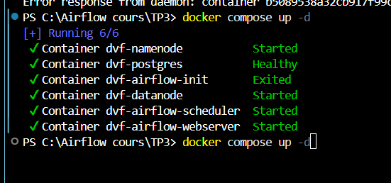

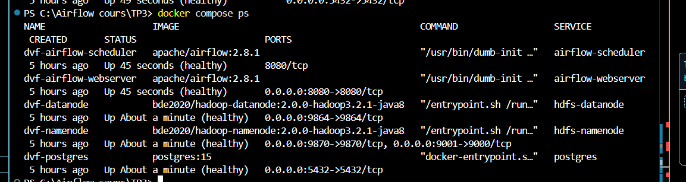

## Capture de la vue Graph

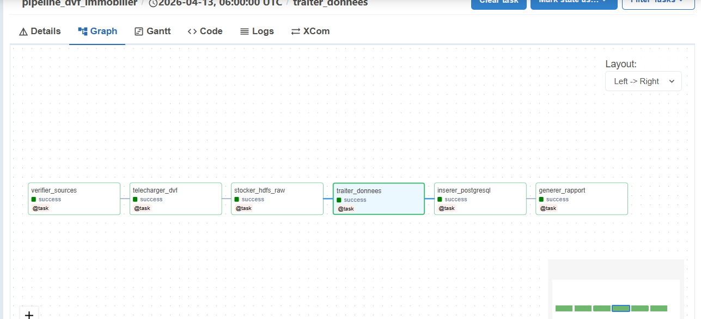

## HDFS contient le fichier DVF
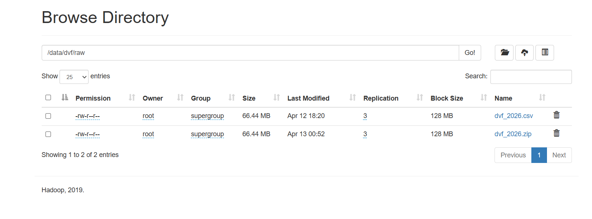

## lOGS DE TELECHARGER dvf

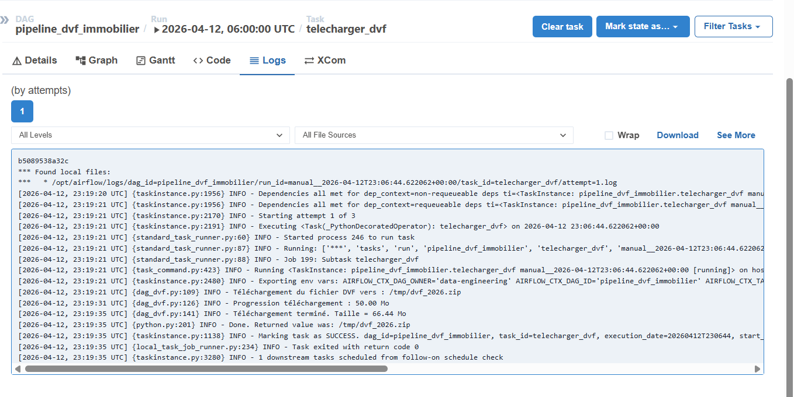

## Stocker HDFS raw

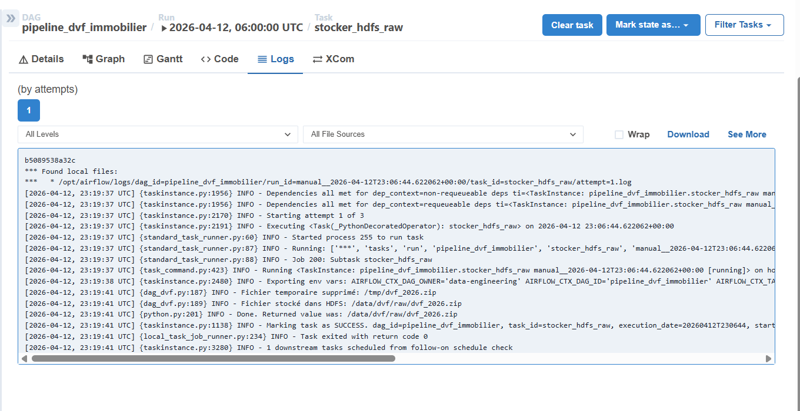

## Logs Inserer Postgrl

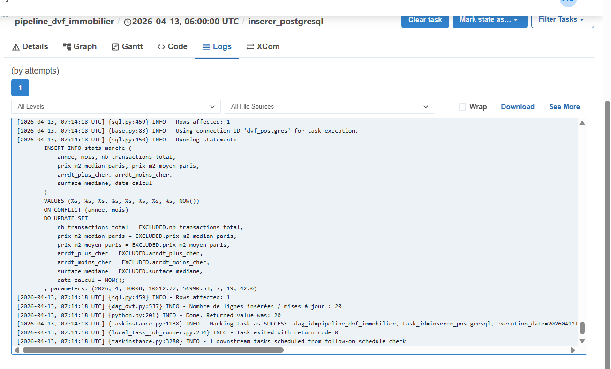

## lOGS generer rapport 
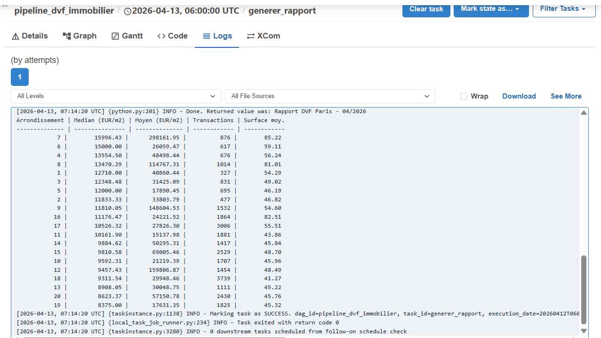

## XCOM generer rapport 
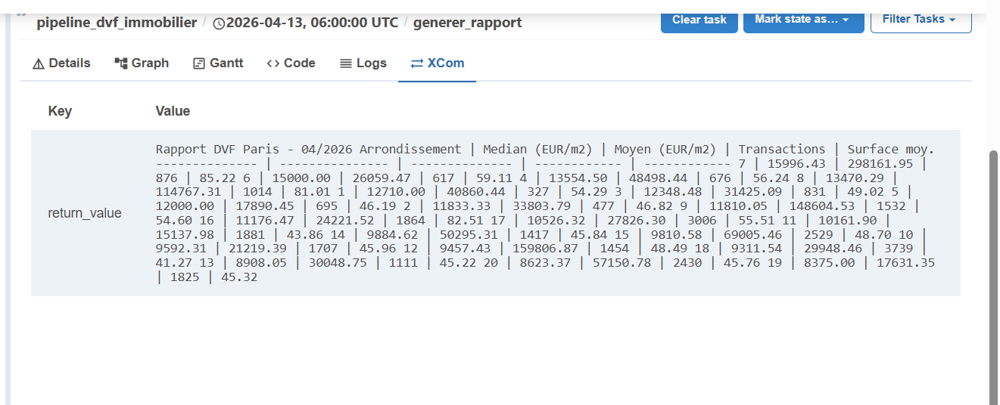

## PostgreSQL avec les requêtes de vérification

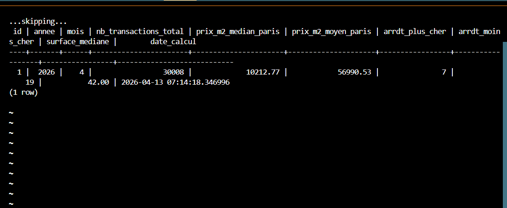

## Les Bonus 

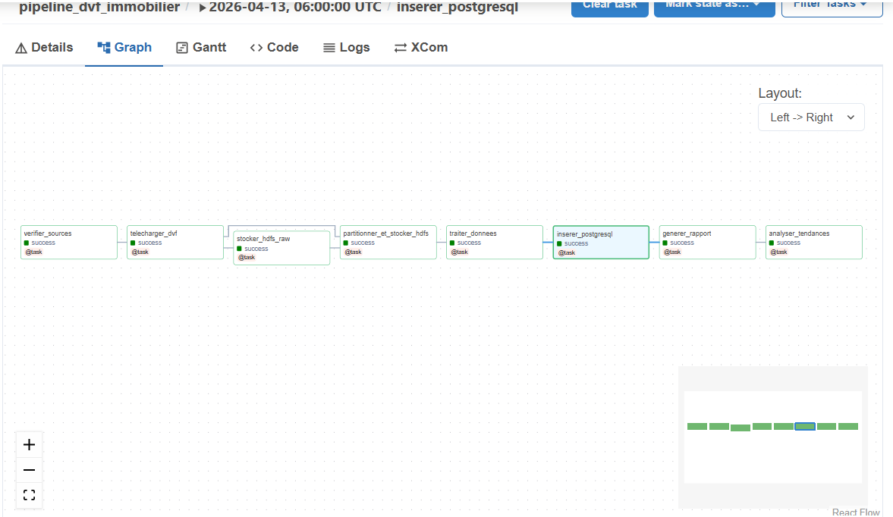

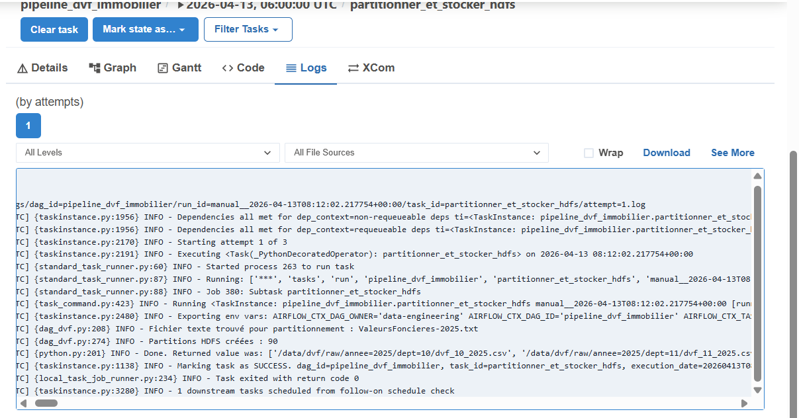

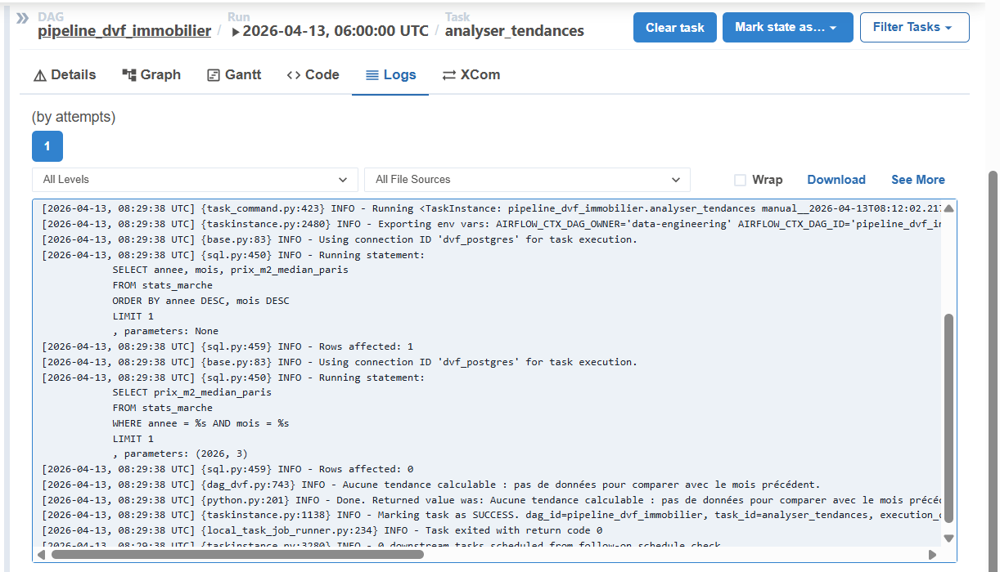

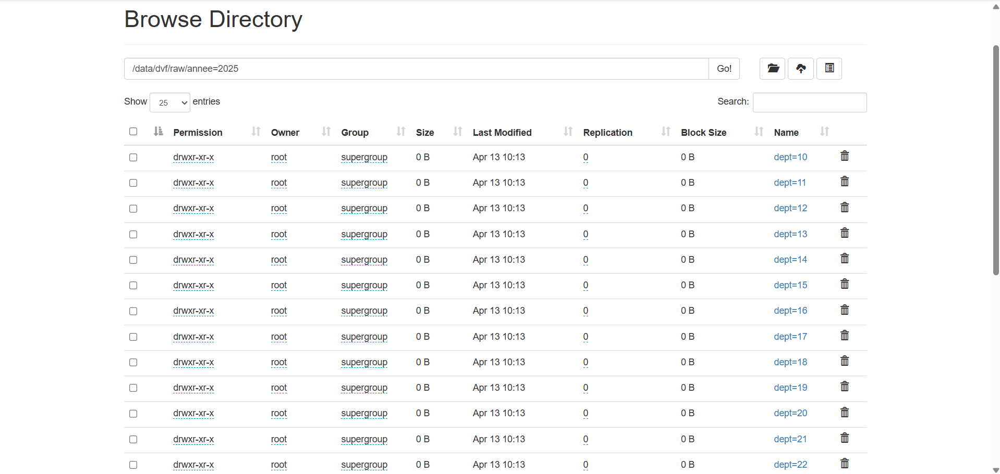

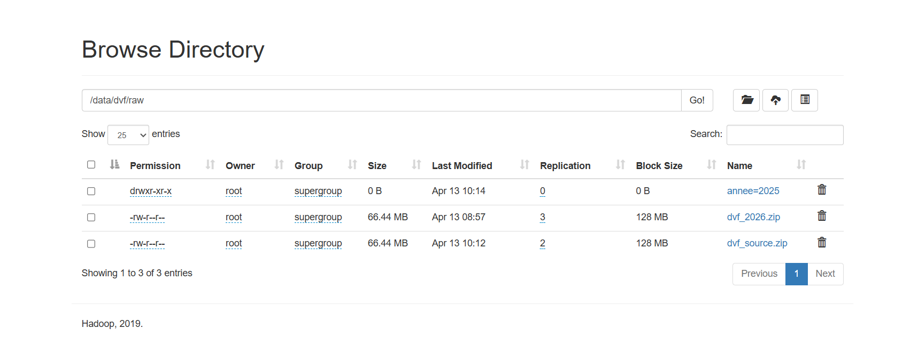

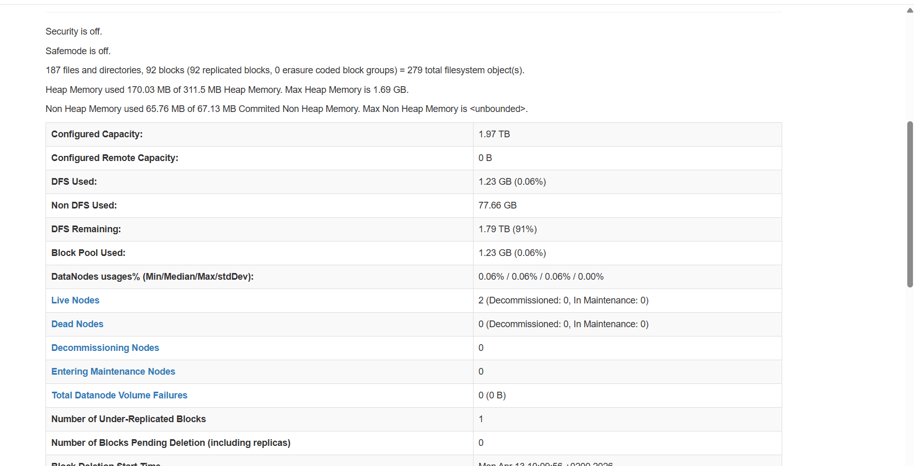

