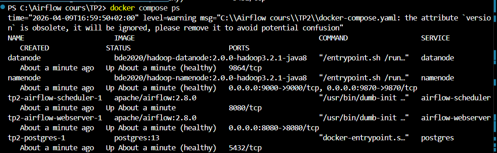
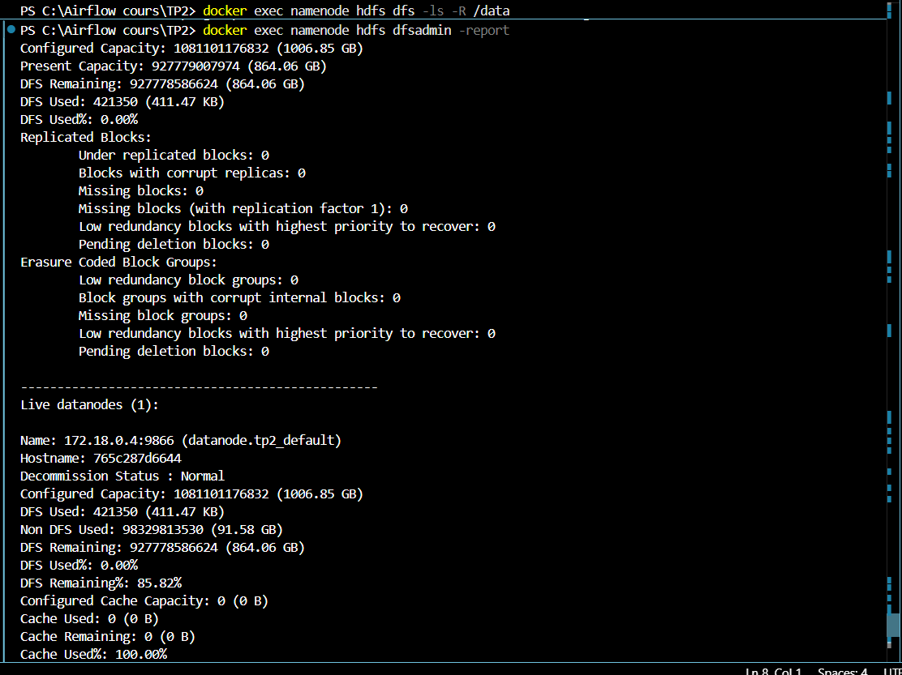
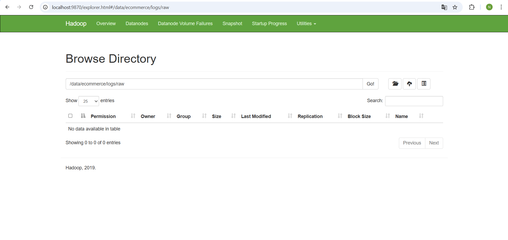
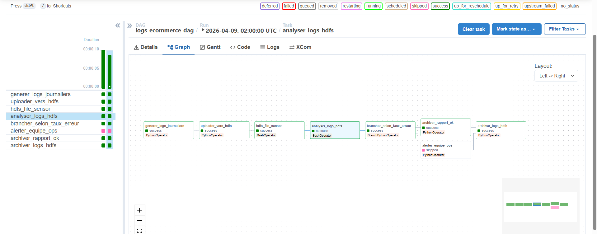
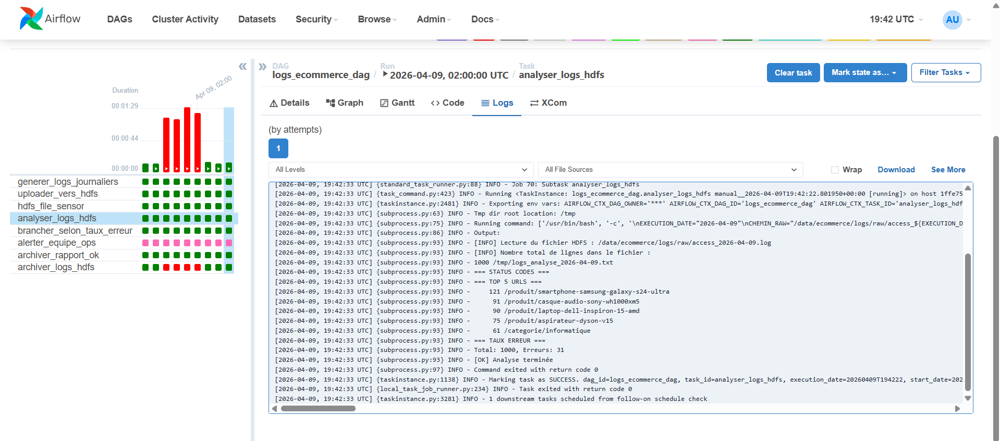
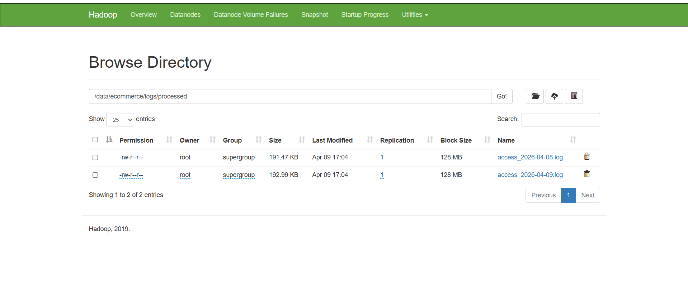

## Les captures 

## 1 docker compose ps montrant tous les conteneurs en état running ou healthy

## 2 docker exec namenode hdfs dfsadmin -report montrant 1 DataNode Live

## 3 Interface Web HDFS — dossier /data/ecommerce/logs/raw/

## 4 Interface Airflow avec les 8 taches

## 5 Exécution complète avec une branche verte et une branche grisée/skipped

## 6 Logs de la tâche analyser_logs_hdfs montrant les status codes et le Top 5 URLs

## 7 Interface Web HDFS — fichier déplacé dans /data/ecommerce/logs/processed/ après exécution 

## Les questions 

## Q1 — HDFS vs système de fichiers local

On ne stocke pas les logs sur un simple disque local ou sur un NFS, car HDFS est plus adapté à un grand volume comme 50 Go par jour.

Trois avantages de HDFS :

- distribution : les données sont réparties sur plusieurs machines
- réplication : plusieurs copies peuvent exister, donc moins de risque de perte
- localité des données : les traitements peuvent se faire près du stockage, ce qui améliore les performances

##  Q2 — NameNode, point de défaillance unique

Le NameNode gère les métadonnées de HDFS. S’il tombe, les DataNodes gardent les données, mais les clients ne savent plus où lire ou écrire. Donc le cluster devient inutilisable.

En production, Hadoop utilise NameNode HA :

- un NameNode actif
- un NameNode standby

Les JournalNodes servent à synchroniser les métadonnées entre les deux pour permettre le basculement.

##  Q3 — HdfsSensor : poke vs reschedule

En mode poke, le sensor attend en gardant le worker occupé.
En mode reschedule, il libère le worker entre deux vérifications.

- poke : utile si l’attente est courte
- reschedule : utile si l’attente est longue ou s’il y a beaucoup de sensors

Le mauvais choix peut bloquer le scheduler si plusieurs sensors en poke occupent tous les workers.

##  Q4 — Réplication HDFS et cohérence

Avec une réplication de 3, un bloc de 128 Mo est copié 3 fois sur 3 DataNodes.
L’écriture se fait en pipeline :

- client → DataNode 1
- DataNode 1 → DataNode 2
- DataNode 2 → DataNode 3

Pendant l’écriture, HDFS garantit qu’on ne lit pas un fichier comme s’il était complètement validé alors qu’il est encore en cours d’écriture.

##  exercice 1

### Exercice 1 — HdfsFileSensor

J’ai créé un sensor personnalisé `HdfsFileSensor` dans `plugins/hdfs_sensor.py`.  
Ce sensor interroge WebHDFS avec `GETFILESTATUS` pour vérifier si un fichier existe dans HDFS.

Je l’ai ajouté dans le DAG entre l’upload vers HDFS et l’analyse des logs.

J’ai testé deux cas :
- fichier présent : le sensor termine immédiatement
- fichier absent : le sensor attend plusieurs cycles avant de continuer

Le mode `reschedule` est plus adapté en production avec `CeleryExecutor`, car il libère les workers entre deux vérifications, contrairement au mode `poke` qui les garde occupés.

## exercice 2 

