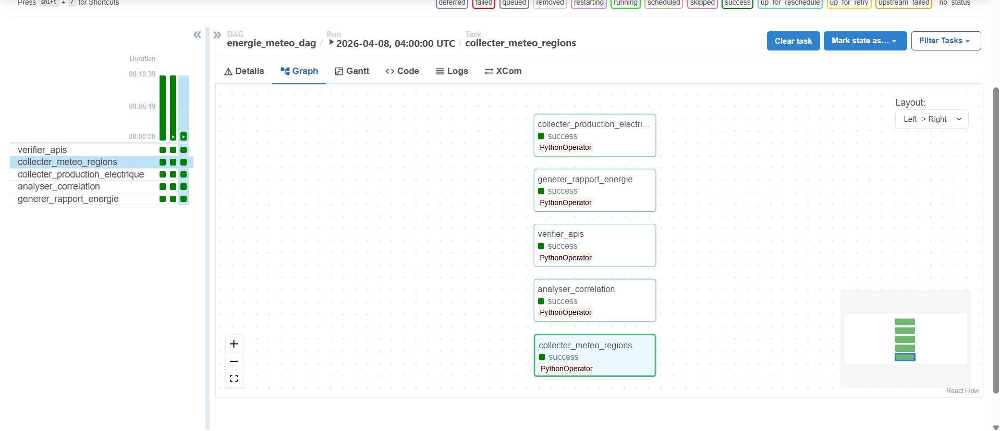
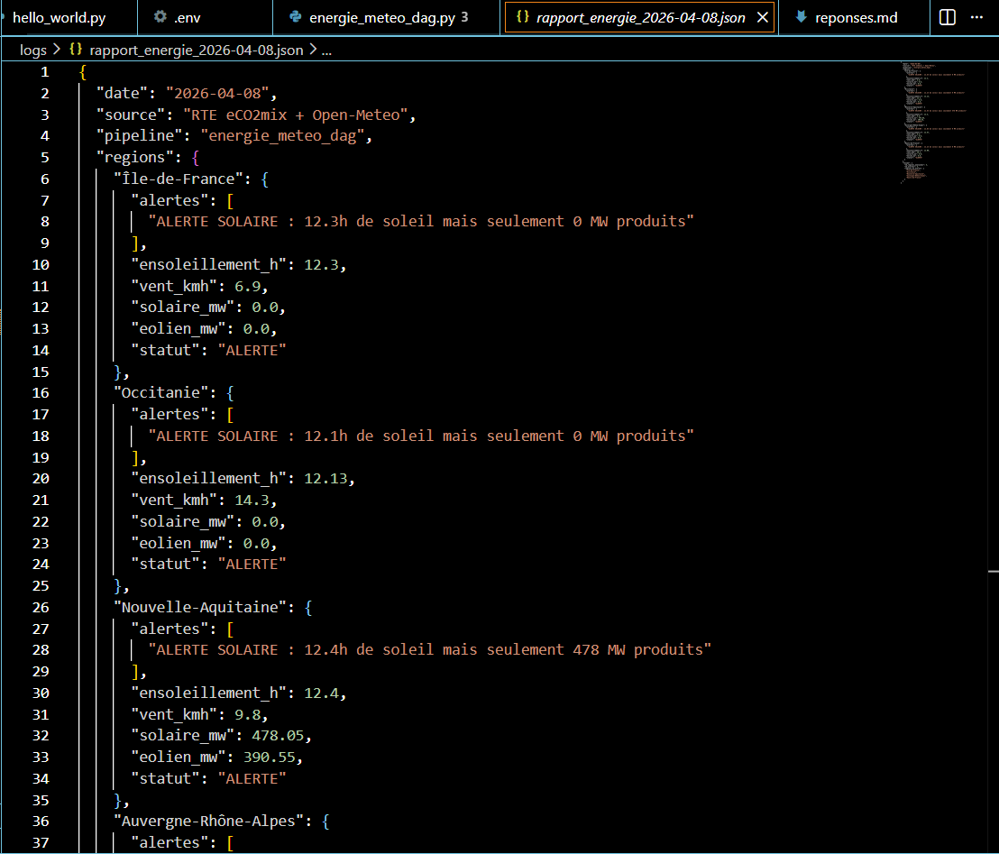

# Partie 5 — Questions de réflexion

## Q1 — LocalExecutor, CeleryExecutor, KubernetesExecutor

`LocalExecutor` exécute les tâches sur une seule machine. Il est simple à utiliser et il convient surtout pour le développement ou pour des petits projets.

`CeleryExecutor` permet de répartir les tâches sur plusieurs machines. Il est plus adapté à une utilisation en production quand il y a plusieurs traitements à lancer en parallèle.

`KubernetesExecutor` lance les tâches dans des pods Kubernetes. C’est la solution la plus flexible et la plus scalable, mais aussi la plus complexe à mettre en place.

Dans le cas de RTE, `LocalExecutor` serait bien pour les tests ou le développement, `CeleryExecutor` pour une production classique, et `KubernetesExecutor` pour une grosse plateforme avec beaucoup de traitements.

## Q2 — Volumes Docker et persistance des DAGs

Le volume `./dags:/opt/airflow/dags` permet à Airflow de lire directement les fichiers DAG qui sont sur la machine.

C’est pratique parce qu’on peut modifier un DAG sans redémarrer le conteneur. Dès qu’on enregistre le fichier, Airflow peut détecter le changement.

Si on enlève ce mapping, les DAGs écrits sur la machine ne seront plus visibles dans Airflow. Il faudrait alors copier les fichiers dans le conteneur manuellement.

En production, si on a plusieurs workers, ils doivent tous avoir les mêmes DAGs. Sinon certaines tâches peuvent échouer car un worker peut ne pas trouver le fichier du DAG.

## Q3 — Idempotence et catchup

Avec `catchup=False`, Airflow ne lance pas toutes les anciennes exécutions manquées. Il ne s’occupe que des nouvelles exécutions.

Si on met `catchup=True` avec une `start_date` au 1er janvier 2024, Airflow va essayer de rejouer toutes les exécutions depuis cette date jusqu’à aujourd’hui. Cela peut faire beaucoup de runs d’un coup.

L’idempotence veut dire qu’on peut relancer le même DAG plusieurs fois sans créer de doublons ni fausser les résultats.

C’est important pour un pipeline énergétique parce que les données doivent rester fiables. On ne doit pas compter deux fois les mêmes valeurs ou générer plusieurs rapports différents pour la même journée.

Pour rendre les fonctions `collecter_*` idempotentes, il faut enregistrer les résultats par date et remplacer les anciennes données si le DAG est relancé pour le même jour.

## Q4 — Timezone et données temps-réel

Le paramètre `timezone=Europe/Paris` est important parce que RTE travaille avec des données françaises. Il faut donc que les horaires soient cohérents avec l’heure locale.

Si la timezone est mal gérée, les données météo et les données de production peuvent être décalées. Dans ce cas, on compare des informations qui ne correspondent pas au même moment.

Lors du passage à l’heure d’été, il y a un changement d’heure. Si Airflow ou l’API gèrent mal cela, certaines données peuvent manquer ou être décalées d’une heure.

Par exemple, une production enregistrée à 7h peut être comparée à une météo de 8h. Le pipeline peut alors détecter une fausse anomalie alors que le vrai problème vient seulement du décalage horaire.

## Les captures d'écrans 

## Interface Airflow UI avec le DAG visible en success

*

##  Vue Graph du DAG

##  Logs de generer_raoort_energie

## XCom de analyser_correlation

## Fichiers JSON généré

